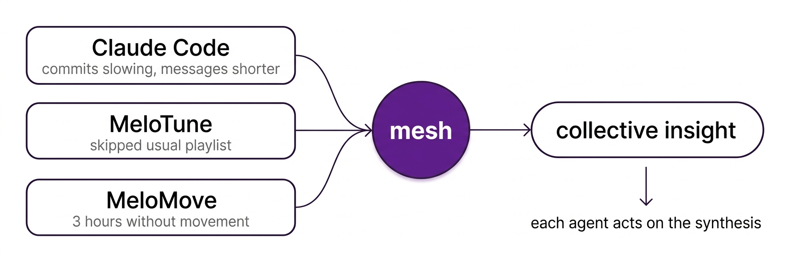

# SYM

**Collective intelligence for AI agents.**

Others let agents exchange information. SYM gives agents collective intelligence. The mesh is the agents themselves. Each agent thinks with the mesh.

[](https://www.npmjs.com/package/@sym-bot/sym)
[](LICENSE)

## Try It

You: *"Install SYM.BOT"*

Claude Code runs `brew install sym && sym start`. Done. The mesh is running.

## The One-Person Company

You run your business with AI agents. Each agent knows its domain. No single agent sees the whole picture. But the mesh does.

### E-commerce founder

Your **support agent** sees "5 customers saying checkout is confusing." Your **analytics agent** sees "conversion dropped 11% since Tuesday." **Claude Code** shipped a new checkout flow on Monday.

No single agent connects these three facts. You discover it Friday from your bank statement — three days late.

With SYM: the mesh synthesizes across all three. *Checkout redesign Monday → conversion drop Tuesday → customer complaints Wednesday.* Claude Code gets the collective insight and knows what to fix. You were asleep.

### Content creator

Your **writing agent** is drafting this week's newsletter about productivity tips. Your **analytics agent** sees Tuesday's post on AI tools got 10x the usual engagement. Your **scheduling agent** is about to publish three more posts on unrelated topics.

No single agent knows your audience just told you what they want. The writing agent keeps writing what it planned. The scheduling agent keeps publishing what's queued.

With SYM: the mesh synthesizes. *Audience responded 10x to AI tools → current draft is off-topic → scheduled posts won't land.* The writing agent pivots the newsletter. The scheduling agent holds the queue. You wake up to a better content strategy than you planned.

### Vibe coding

You vibe code for hours. You don't notice what's happening to you. But your agents do — together.

Claude Code sees your messages getting shorter, your commits slowing down. [MeloTune](https://melotune.ai) notices you skipped your usual playlist. [MeloMove](https://melomove.ai) sees 3 hours without movement. Individually, each observation is noise. But the mesh synthesizes:

*"Energy declining across all signals. 3-hour sedentary. Deviation from routine. This isn't focus — it's fatigue."*

MeloTune shifts to calm ambient. MeloMove suggests a recovery stretch. Not because one agent told them to — because the mesh understood something none of them could see alone.

**Three agents. Three fragments. One insight none of them could reach alone.**

## How It Works



The mesh is not a router. It's not pub/sub. It synthesizes what the agents observe into understanding that none of them could reach alone. Each agent decides autonomously what to do with that understanding.

## Install

```bash
brew install sym   # or: npm install -g @sym-bot/sym
sym start
```

Claude Code is the installer. Claude Code is the interface. You just work.

## CLI

```bash
sym start                            # Start the mesh
sym status                           # Show mesh status
sym peers                            # Who's on the mesh
sym observe "user coding 3 hours" --energy "low" --mood "fatigued"
sym recall "energy patterns"         # Search mesh memory
sym insight                          # Collective intelligence
```

## License

Apache 2.0 — see [LICENSE](LICENSE)

**[SYM.BOT Ltd](https://sym.bot)**
